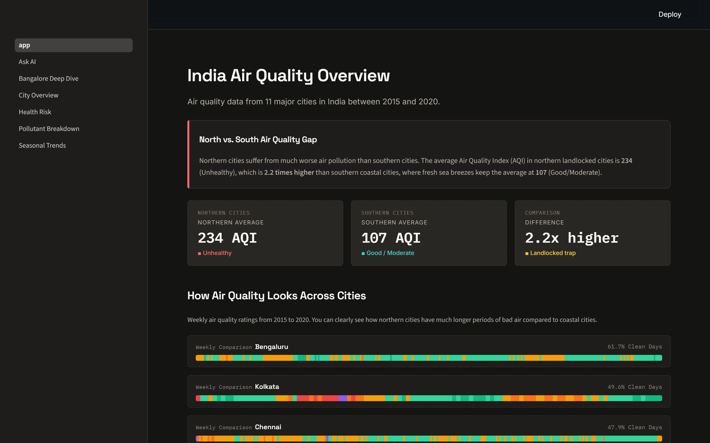
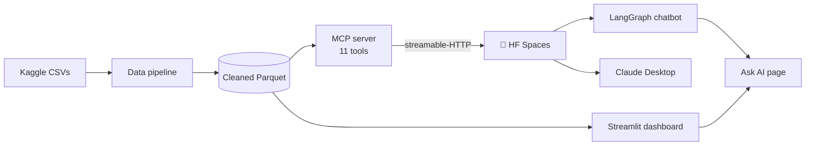
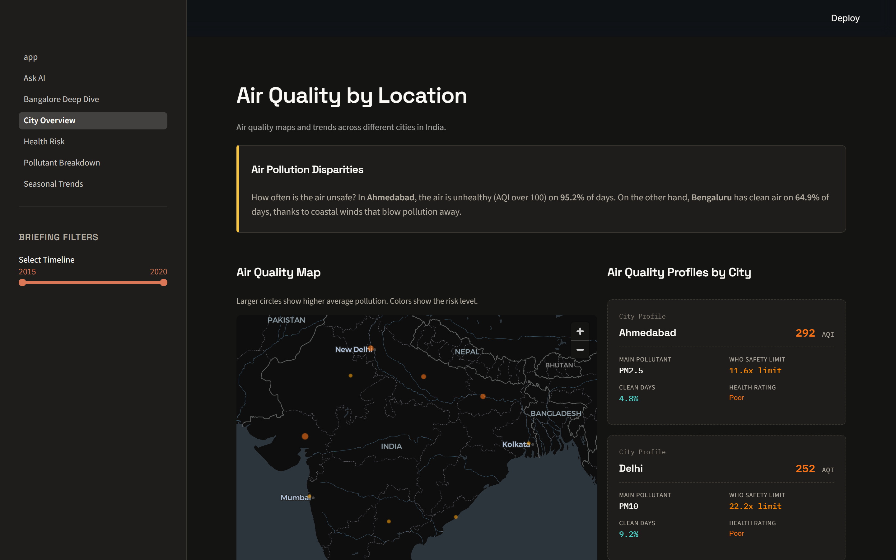
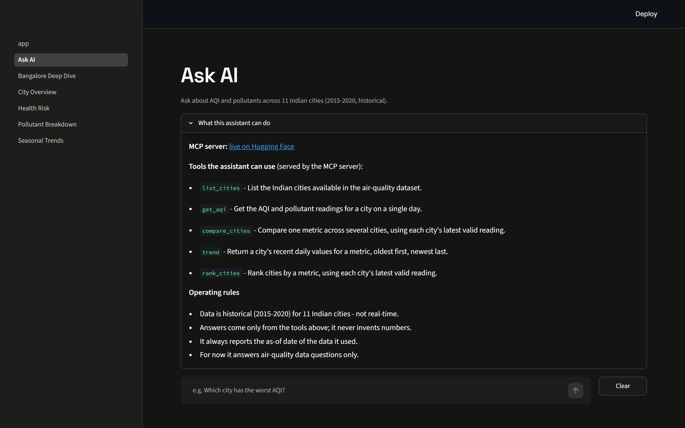

# 🌍 India Air Quality Intelligence Platform

[](https://www.python.org/)
[](https://streamlit.io/)
[](https://modelcontextprotocol.io)
[](https://huggingface.co/spaces/Bhuvandesai/india-air-quality)
[](#license)

An environmental-intelligence platform that tracks and visualizes air-quality trends across
**11 major Indian cities (2015–2020)** — and exposes the same analysis to LLMs through a
remote **Model Context Protocol (MCP)** server and a built-in **Ask AI** chatbot.

**Live dashboard → [bhuvan-desai-india-air-quality-data-analysis.streamlit.app](https://bhuvan-desai-india-air-quality-data-analysis.streamlit.app/)**



## What's inside

- **Interactive dashboard** — national overview, geographic disparities, pollutant
  profiles vs WHO/CPCB limits, seasonal & COVID-lockdown dynamics, health-risk exposure,
  and a Bangalore street-level deep dive.
- **MCP server (agentic layer)** — 11 tools over streamable-HTTP, deployed on Hugging Face
  Spaces, so any MCP client (Claude Desktop, a LangGraph agent) answers data questions by
  *calling tools* instead of guessing.
- **Ask AI chatbot** — a LangGraph ReAct agent (Groq Llama 3.3 70B) that calls those tools
  and shows which it used.

## Architecture



## Quickstart

```bash
git clone https://github.com/Bhuvan-Desai21/India-Air-Quality-Dashboard.git
cd India-Air-Quality-Dashboard
python -m venv .venv
.venv\Scripts\python.exe -m pip install -r requirements.txt   # includes mcp[cli]
streamlit run app.py            # dashboard at http://localhost:8501
```

To reprocess data, drop the Kaggle `city_day.csv`, `station_day.csv`, `stations.csv` into
`data/raw/` and run `python notebooks/01_data_pipeline.py`.



## MCP server — 11 tools

The same analysis is exposed as an MCP server (`air_quality_mcp.py`). It reads the cleaned
parquet directly (no Streamlit dependency) and resolves data paths from the script
location, so it runs from any working directory. Data is **historical**; every tool reports
the `as_of` date it used.

| Tool | Example | Purpose |
| --- | --- | --- |
| `list_cities()` | `list_cities()` | Cities + dataset coverage (2015–2020). |
| `get_aqi(city, date?)` | `get_aqi("Delhi")` | AQI, category, all pollutants for a day. |
| `compare_cities(cities, metric)` | `compare_cities(["Delhi","Mumbai"], "pm25")` | One metric across cities. |
| `trend(city, metric, days)` | `trend("Delhi", "pm25", 30)` | Recent daily series + summary. |
| `rank_cities(metric, n, order)` | `rank_cities("aqi", 5, "desc")` | Worst/best cities right now. |
| `seasonal_breakdown(city, metric)` | `seasonal_breakdown("Delhi")` | Metric by Indian season. |
| `lockdown_impact(city, metric)` | `lockdown_impact("Delhi")` | Mar–Jun 2019 vs 2020 (COVID). |
| `health_advisory(city, date?)` | `health_advisory("Delhi")` | AQI category + health guidance. |
| `yearly_summary(city, metric)` | `yearly_summary("Delhi", "pm25")` | Year-by-year trajectory. |
| `compare_to_standard(city, pollutant)` | `compare_to_standard("Delhi", "pm25")` | Level vs WHO/CPCB limits. |
| `station_breakdown(metric, order, n)` | `station_breakdown(order="desc")` | Bengaluru hyperlocal ranking. |

### Run / test

```bash
.venv\Scripts\python.exe smoke_test.py          # exercise all 11 tools, no protocol
.venv\Scripts\mcp.exe dev air_quality_mcp.py    # MCP Inspector (needs Node/npx)
```

### Transports

The same file serves every client; transport is chosen by env var:

| `MCP_TRANSPORT` | Behaviour | Used by |
| --- | --- | --- |
| `stdio` (default) | `mcp.run()` | local dev, MCP Inspector, Claude Desktop |
| `http` | streamable-HTTP on `0.0.0.0:$PORT`, optional bearer auth | HF Spaces, LangGraph client |

### Remote deployment (Hugging Face Spaces)

Deployed as a Docker Space: **[Bhuvandesai/india-air-quality](https://huggingface.co/spaces/Bhuvandesai/india-air-quality)**.

- **Endpoint:** `POST https://Bhuvandesai-india-air-quality.hf.space/mcp`
- **Auth:** `Authorization: Bearer <token>` when the `MCP_AUTH_TOKEN` secret is set; `GET /`
  is an open health page.
- The deployable copy (server, both parquets, `Dockerfile`, minimal `requirements.txt`,
  Space `README.md`) lives in [`hf-space/`](hf-space/) and stays byte-identical to the root server.

## Ask AI (chatbot)



The **Ask AI** page (`pages/Ask_AI.py`) is a LangGraph ReAct agent (Groq
`llama-3.3-70b-versatile`) that answers air-quality questions by calling the deployed MCP
tools over streamable-HTTP, keeps multi-turn memory, and shows which tools it used.

- `chatbot/config.py` — environment-based settings and logging.
- `chatbot/runtime.py` — background event loop bridging async MCP tools to Streamlit.
- `chatbot/agent.py` — loads MCP tools via `langchain-mcp-adapters`, builds the agent with
  `create_react_agent` + a `MemorySaver` checkpointer.
- `pages/Ask_AI.py` — the Streamlit chat UI.

Add keys to `.streamlit/secrets.toml` (gitignored; template at
`.streamlit/secrets.toml.example`):

```toml
GROQ_API_KEY = "gsk_..."
MCP_AUTH_TOKEN = "aqmcp_..."
```

Then `streamlit run app.py` and open **Ask AI** — e.g. *"Which city has the worst AQI?"*.

## Data

Central Pollution Control Board (CPCB) via Kaggle — 11 cities + 10 Bangalore stations,
daily, 2015-01-01 → 2020-07-01. Cleaned to compressed Parquet under `data/processed/`.

## License

Open-source under the **MIT License**.
