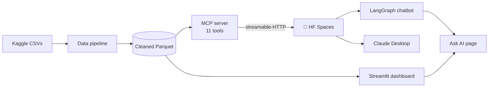

# MCP Tools + README Glowup + UI Touchups Implementation Plan

> **For agentic workers:** REQUIRED SUB-SKILL: Use superpowers:subagent-driven-development (recommended) or superpowers:executing-plans to implement this plan task-by-task. Steps use checkbox (`- [ ]`) syntax for tracking.

**Goal:** Add six new MCP tools (5 → 11), fix the dashboard UI (undefined-in-charts bug + cool-gray palette stragglers), and deliver a full README glowup for both the GitHub root README and the Hugging Face Space card.

**Architecture:** The single-file `air_quality_mcp.py` gains a second (station) dataframe plus six new `@mcp.tool()` functions that reuse existing helpers; the file is copied byte-identical to `hf-space/`. UI work is in-place edits to `app.py`/`pages/*.py` with no layout change. READMEs are rewritten with badges, a Mermaid diagram, an 11-tool table, and real screenshots.

**Tech Stack:** Python 3.13, FastMCP (`mcp[cli]`), pandas/pyarrow, Streamlit + Plotly, Docker (HF Spaces).

Spec: `docs/superpowers/specs/2026-06-19-tools-readme-ui-design.md`

Branch: `feat/tools-readme-ui` (already created; spec already committed).

**Commit policy for this repo:** NEVER add a `Co-Authored-By` trailer to commit messages.

---

## Phase A — Six new MCP tools

### Task 1: Add shared constants, station data layer, and helpers to the server

**Files:**
- Modify: `air_quality_mcp.py` (insert after the existing helpers/`_coverage`, before the `# --- MCP server ---` block near line 80)

- [ ] **Step 1: Add the station data layer and new constants**

Insert this block immediately after the `_coverage()` function (currently ends ~line 78) and before the `# --- MCP server ---` comment:

```python
# --- Station (Bengaluru hyperlocal) data layer --------------------------------
# A second cleaned parquet: 10 Bengaluru monitoring stations, same pollutant columns.
# Loaded once at import, path resolved from __file__ like the city frame.
_STATION_PATH = (
    Path(__file__).resolve().parent / "data" / "processed" / "station_day_blr_clean.parquet"
)
_station_df = pd.read_parquet(_STATION_PATH)
_station_df["Date"] = pd.to_datetime(_station_df["Date"])


def _station_frame(station: str) -> pd.DataFrame:
    return _station_df[_station_df["StationShort"] == station]


# --- Constants for the analytical tools ---------------------------------------
SEASON_ORDER: list[str] = ["Winter", "Spring", "Monsoon", "Post-Monsoon"]

# WHO 2021 annual guideline values (µg/m³); None where WHO sets no annual value here.
WHO_LIMITS: dict[str, float | None] = {
    "PM2.5": 5.0, "PM10": 15.0, "NO2": 10.0, "SO2": None, "O3": 60.0, "CO": None, "NH3": None,
}
# CPCB annual standards (India), µg/m³ (CO would be mg/m³ but has no annual std here).
CPCB_LIMITS: dict[str, float | None] = {
    "PM2.5": 40.0, "PM10": 60.0, "NO2": 40.0, "SO2": 50.0, "O3": None, "CO": None, "NH3": None,
}
UNITS: dict[str, str] = {
    "PM2.5": "µg/m³", "PM10": "µg/m³", "NO2": "µg/m³", "SO2": "µg/m³",
    "O3": "µg/m³", "CO": "mg/m³", "NH3": "µg/m³",
}

# CPCB-band health guidance: category -> (advisory, who is most at risk).
ADVISORY: dict[str, tuple[str, str]] = {
    "Good": ("Air quality is good; safe for everyone.", "None."),
    "Satisfactory": (
        "Acceptable air; very sensitive individuals may feel minor discomfort.",
        "Highly sensitive people.",
    ),
    "Moderate": (
        "May cause breathing discomfort to people with lung or heart disease, "
        "children, and older adults.",
        "Asthma/heart patients, children, the elderly.",
    ),
    "Poor": (
        "Breathing discomfort on prolonged exposure; sensitive groups should limit "
        "outdoor exertion.",
        "Most people on prolonged exposure.",
    ),
    "Very Poor": (
        "Respiratory illness on prolonged exposure; avoid outdoor activity.",
        "Everyone, seriously for sensitive groups.",
    ),
    "Severe": (
        "Serious health impact even on light activity; stay indoors.",
        "Everyone.",
    ),
    "Unknown": ("No health category available for this reading.", "Unknown."),
}


def _aqi_category(aqi: float) -> str:
    """Map a numeric AQI to its CPCB band (matches the dashboard buckets)."""
    if aqi <= 50:
        return "Good"
    if aqi <= 100:
        return "Satisfactory"
    if aqi <= 200:
        return "Moderate"
    if aqi <= 300:
        return "Poor"
    if aqi <= 400:
        return "Very Poor"
    return "Severe"
```

- [ ] **Step 2: Verify the module still imports and station data loads**

Run: `.venv/Scripts/python.exe -c "import air_quality_mcp as s; print(len(s._station_df), s._station_df['StationShort'].nunique())"`
Expected: prints a row count and `10`.

- [ ] **Step 3: Commit**

```bash
git add air_quality_mcp.py
git commit -m "feat(mcp): add station data layer, advisory/limit constants, aqi category helper"
```

---

### Task 2: Add `seasonal_breakdown` and `yearly_summary` tools

**Files:**
- Modify: `air_quality_mcp.py` (insert after the `rank_cities` tool, before `def _run_http()`)
- Test: `smoke_test.py`

- [ ] **Step 1: Add a failing smoke check**

In `smoke_test.py`, add these lines inside `__main__` after the existing `trend(...)` show call (before the `# Error handling` comment):

```python
    show("seasonal_breakdown('Delhi')", srv.seasonal_breakdown("Delhi"))
    show("yearly_summary('Delhi', 'pm25')", srv.yearly_summary("Delhi", "pm25"))
```

- [ ] **Step 2: Run to verify it fails**

Run: `.venv/Scripts/python.exe smoke_test.py`
Expected: FAIL with `AttributeError: module 'air_quality_mcp' has no attribute 'seasonal_breakdown'`.

- [ ] **Step 3: Implement both tools**

Insert after `rank_cities` (after its `return` at ~line 278), before `def _run_http()`:

```python
@mcp.tool()
def seasonal_breakdown(city: str, metric: str = "aqi") -> dict:
    """Average a metric by season for a city: Winter, Spring, Monsoon, Post-Monsoon.

    Good for "is Delhi's pollution worse in winter?". Indian seasons, not calendar
    quarters: Winter (Dec-Feb), Spring (Mar-May), Monsoon (Jun-Sep), Post-Monsoon
    (Oct-Nov), aggregated across all years 2015-2020.

    Args:
        city: City name (case-insensitive).
        metric: One of aqi, pm25, pm10, no2, so2, o3, co, nh3. Defaults to aqi.

    Returns {"city", "metric", "seasons": {season: {avg, min, max, n}}, "peak_season",
    "cleanest_season"}. Seasons with no data are omitted. Unknown city/metric → error.
    """
    canon = _resolve_city(city)
    if canon is None:
        return {"error": f"Unknown city '{city}'. Call list_cities for valid names."}
    col = _resolve_metric(metric)
    if col is None:
        return {"error": f"Unknown metric '{metric}'. Valid metrics: {VALID_METRICS}."}
    frame = _city_frame(canon).dropna(subset=[col])
    if frame.empty:
        return {"error": f"No valid {metric} readings for {canon}."}

    seasons: dict[str, dict] = {}
    for season in SEASON_ORDER:
        s = frame[frame["Season"] == season][col]
        if s.empty:
            continue
        seasons[season] = {
            "avg": round(float(s.mean()), 2),
            "min": round(float(s.min()), 2),
            "max": round(float(s.max()), 2),
            "n": int(s.count()),
        }
    if not seasons:
        return {"error": f"No seasonal data for {canon}."}
    peak = max(seasons, key=lambda k: seasons[k]["avg"])
    cleanest = min(seasons, key=lambda k: seasons[k]["avg"])
    return {
        "city": canon,
        "metric": metric.lower(),
        "seasons": seasons,
        "peak_season": peak,
        "cleanest_season": cleanest,
    }


@mcp.tool()
def yearly_summary(city: str, metric: str = "aqi") -> dict:
    """Year-by-year averages (2015-2020) for a metric in a city.

    Answers "is Delhi's air getting better or worse over the years?".

    Args:
        city: City name (case-insensitive).
        metric: One of aqi, pm25, pm10, no2, so2, o3, co, nh3. Defaults to aqi.

    Returns {"city", "metric", "years": [{year, avg, min, max, n}...], "direction"}
    where direction compares the first vs last year with data. Note 2020 is a partial
    year (data ends 2020-07-01). Unknown city/metric → error.
    """
    canon = _resolve_city(city)
    if canon is None:
        return {"error": f"Unknown city '{city}'. Call list_cities for valid names."}
    col = _resolve_metric(metric)
    if col is None:
        return {"error": f"Unknown metric '{metric}'. Valid metrics: {VALID_METRICS}."}
    frame = _city_frame(canon).dropna(subset=[col])
    if frame.empty:
        return {"error": f"No valid {metric} readings for {canon}."}

    years = []
    for year, g in frame.groupby("Year"):
        years.append({
            "year": int(year),
            "avg": round(float(g[col].mean()), 2),
            "min": round(float(g[col].min()), 2),
            "max": round(float(g[col].max()), 2),
            "n": int(g[col].count()),
        })
    years.sort(key=lambda y: y["year"])
    direction = (
        "rising" if years[-1]["avg"] > years[0]["avg"]
        else "falling" if years[-1]["avg"] < years[0]["avg"] else "flat"
    )
    return {"city": canon, "metric": metric.lower(), "years": years, "direction": direction}
```

- [ ] **Step 4: Run to verify it passes**

Run: `.venv/Scripts/python.exe smoke_test.py`
Expected: PASS — both new sections print; `seasons` has keys in Winter/Spring/Monsoon/Post-Monsoon order; `yearly_summary` lists 2015..2020.

- [ ] **Step 5: Commit**

```bash
git add air_quality_mcp.py smoke_test.py
git commit -m "feat(mcp): add seasonal_breakdown and yearly_summary tools"
```

---

### Task 3: Add `lockdown_impact` tool

**Files:**
- Modify: `air_quality_mcp.py` (after `yearly_summary`)
- Test: `smoke_test.py`

- [ ] **Step 1: Add a failing smoke check**

In `smoke_test.py`, after the `yearly_summary` show line, add:

```python
    show("lockdown_impact('Delhi')", srv.lockdown_impact("Delhi"))
```

- [ ] **Step 2: Run to verify it fails**

Run: `.venv/Scripts/python.exe smoke_test.py`
Expected: FAIL with `AttributeError: ... 'lockdown_impact'`.

- [ ] **Step 3: Implement the tool**

Insert after `yearly_summary`:

```python
@mcp.tool()
def lockdown_impact(city: str, metric: str = "aqi") -> dict:
    """Compare a city's metric in Mar-Jun 2019 vs Mar-Jun 2020 (the COVID lockdown).

    India's nationwide lockdown began 25 Mar 2020. This compares the same months
    (March-June) one year apart to isolate the lockdown's effect on air quality.

    Args:
        city: City name (case-insensitive).
        metric: One of aqi, pm25, pm10, no2, so2, o3, co, nh3. Defaults to aqi.

    Returns {"city", "metric", "window": "Mar-Jun", "before": {year, avg, n},
    "after": {year, avg, n}, "change_pct", "direction"}. change_pct/direction are null
    (with a note) if either year lacks data in the window. Unknown city/metric → error.
    """
    canon = _resolve_city(city)
    if canon is None:
        return {"error": f"Unknown city '{city}'. Call list_cities for valid names."}
    col = _resolve_metric(metric)
    if col is None:
        return {"error": f"Unknown metric '{metric}'. Valid metrics: {VALID_METRICS}."}
    window = _city_frame(canon)
    window = window[window["Month"].isin([3, 4, 5, 6])].dropna(subset=[col])

    def side(year: int) -> dict | None:
        s = window[window["Year"] == year][col]
        if s.empty:
            return None
        return {"year": year, "avg": round(float(s.mean()), 2), "n": int(s.count())}

    before, after = side(2019), side(2020)
    result: dict = {
        "city": canon, "metric": metric.lower(), "window": "Mar-Jun",
        "before": before, "after": after,
    }
    if before and after and before["avg"] != 0:
        change = (after["avg"] - before["avg"]) / before["avg"] * 100
        result["change_pct"] = round(change, 1)
        result["direction"] = "fell" if change < 0 else "rose" if change > 0 else "flat"
    else:
        result["change_pct"] = None
        result["direction"] = None
        result["note"] = "Need both 2019 and 2020 data in Mar-Jun to compute change."
    return result
```

- [ ] **Step 4: Run to verify it passes**

Run: `.venv/Scripts/python.exe smoke_test.py`
Expected: PASS — `before.year=2019`, `after.year=2020`, `change_pct` negative for Delhi (cleaner in 2020).

- [ ] **Step 5: Commit**

```bash
git add air_quality_mcp.py smoke_test.py
git commit -m "feat(mcp): add lockdown_impact tool"
```

---

### Task 4: Add `health_advisory` tool

**Files:**
- Modify: `air_quality_mcp.py` (after `lockdown_impact`)
- Test: `smoke_test.py`

- [ ] **Step 1: Add a failing smoke check**

In `smoke_test.py`, add after the `lockdown_impact` show line:

```python
    show("health_advisory('Delhi')", srv.health_advisory("Delhi"))
    show("health_advisory('Gotham')  # unknown city", srv.health_advisory("Gotham"))
```

- [ ] **Step 2: Run to verify it fails**

Run: `.venv/Scripts/python.exe smoke_test.py`
Expected: FAIL with `AttributeError: ... 'health_advisory'`.

- [ ] **Step 3: Implement the tool**

Insert after `lockdown_impact`. It reuses `get_aqi` (FastMCP's `@tool` returns the original function, so calling it directly works):

```python
@mcp.tool()
def health_advisory(city: str, date: str | None = None) -> dict:
    """Plain-language health guidance for a city's air quality on a day.

    Resolves the AQI exactly like get_aqi (latest valid reading, or a given
    YYYY-MM-DD date), then maps it to its CPCB category and the recommended
    precautions plus who is most at risk.

    Args:
        city: City name (case-insensitive).
        date: Optional "YYYY-MM-DD"; omitted → latest valid AQI day for the city.

    Returns {"city", "as_of", "aqi", "category", "advisory", "sensitive_groups"}.
    Unknown city / no reading → {"error": ...} (same shape as get_aqi).
    """
    reading = get_aqi(city, date)
    if "error" in reading:
        return reading
    aqi = reading["aqi"]
    if aqi is None:
        return {"error": f"No AQI value to advise on for {reading['city']}."}
    category = reading.get("aqi_category") or _aqi_category(aqi)
    advisory, groups = ADVISORY.get(category, ADVISORY["Unknown"])
    return {
        "city": reading["city"],
        "as_of": reading["as_of"],
        "aqi": aqi,
        "category": category,
        "advisory": advisory,
        "sensitive_groups": groups,
    }
```

- [ ] **Step 4: Run to verify it passes**

Run: `.venv/Scripts/python.exe smoke_test.py`
Expected: PASS — Delhi returns a `category` + `advisory`; `Gotham` returns `{"error": ...}`.

- [ ] **Step 5: Commit**

```bash
git add air_quality_mcp.py smoke_test.py
git commit -m "feat(mcp): add health_advisory tool"
```

---

### Task 5: Add `compare_to_standard` tool

**Files:**
- Modify: `air_quality_mcp.py` (after `health_advisory`)
- Test: `smoke_test.py`

- [ ] **Step 1: Add a failing smoke check**

In `smoke_test.py`, add after the `health_advisory('Gotham')` line:

```python
    show("compare_to_standard('Delhi', 'pm25')", srv.compare_to_standard("Delhi", "pm25"))
    show("compare_to_standard('Delhi', 'aqi')  # aqi rejected",
         srv.compare_to_standard("Delhi", "aqi"))
```

- [ ] **Step 2: Run to verify it fails**

Run: `.venv/Scripts/python.exe smoke_test.py`
Expected: FAIL with `AttributeError: ... 'compare_to_standard'`.

- [ ] **Step 3: Implement the tool**

Insert after `health_advisory`:

```python
@mcp.tool()
def compare_to_standard(city: str, pollutant: str) -> dict:
    """Compare a city's latest pollutant level to WHO and CPCB safe limits.

    Answers "how far over the safe limit is Delhi's PM2.5?". Uses the city's most
    recent non-null reading for the pollutant. AQI is not a pollutant and is rejected.

    Args:
        city: City name (case-insensitive).
        pollutant: One of pm25, pm10, no2, so2, o3, co, nh3 (NOT aqi).

    Returns {"city", "pollutant", "value", "as_of", "unit", "who_limit",
    "who_multiple", "cpcb_limit", "cpcb_multiple", "verdict"}. A limit that does not
    exist for the pollutant comes back null with a null multiple. Unknown city or a
    non-pollutant input → {"error": ...}.
    """
    canon = _resolve_city(city)
    if canon is None:
        return {"error": f"Unknown city '{city}'. Call list_cities for valid names."}
    col = _resolve_metric(pollutant)
    if col is None or col == "AQI":
        return {
            "error": f"'{pollutant}' is not a pollutant. Choose one of "
            "pm25, pm10, no2, so2, o3, co, nh3."
        }
    value, as_of = _latest_valid(_city_frame(canon), col)
    if value is None:
        return {"error": f"No valid {pollutant} readings for {canon}."}

    who, cpcb = WHO_LIMITS.get(col), CPCB_LIMITS.get(col)
    who_mult = round(value / who, 2) if who else None
    cpcb_mult = round(value / cpcb, 2) if cpcb else None
    if who_mult is not None:
        verdict = (
            f"{who_mult}x the WHO annual limit" if who_mult > 1 else "within the WHO annual limit"
        )
    elif cpcb_mult is not None:
        verdict = (
            f"{cpcb_mult}x the CPCB annual limit" if cpcb_mult > 1 else "within the CPCB annual limit"
        )
    else:
        verdict = "no annual limit defined for this pollutant"
    return {
        "city": canon,
        "pollutant": col,
        "value": value,
        "as_of": as_of,
        "unit": UNITS.get(col),
        "who_limit": who,
        "who_multiple": who_mult,
        "cpcb_limit": cpcb,
        "cpcb_multiple": cpcb_mult,
        "verdict": verdict,
    }
```

- [ ] **Step 4: Run to verify it passes**

Run: `.venv/Scripts/python.exe smoke_test.py`
Expected: PASS — Delhi pm25 shows a `who_multiple` > 1 and a verdict; `aqi` returns `{"error": ...}`.

- [ ] **Step 5: Commit**

```bash
git add air_quality_mcp.py smoke_test.py
git commit -m "feat(mcp): add compare_to_standard tool"
```

---

### Task 6: Add `station_breakdown` tool

**Files:**
- Modify: `air_quality_mcp.py` (after `compare_to_standard`)
- Test: `smoke_test.py`

- [ ] **Step 1: Add a failing smoke check**

In `smoke_test.py`, add after the `compare_to_standard('Delhi', 'aqi')` line:

```python
    show("station_breakdown(order='desc')  # Bengaluru worst-first",
         srv.station_breakdown(order="desc"))
```

- [ ] **Step 2: Run to verify it fails**

Run: `.venv/Scripts/python.exe smoke_test.py`
Expected: FAIL with `AttributeError: ... 'station_breakdown'`.

- [ ] **Step 3: Implement the tool**

Insert after `compare_to_standard`:

```python
@mcp.tool()
def station_breakdown(metric: str = "aqi", order: str = "desc", n: int = 10) -> dict:
    """Rank Bengaluru's neighbourhood monitoring stations by a metric (hyperlocal).

    Answers "which part of Bengaluru has the worst air?". Uses each station's latest
    valid reading. Stations include Silk Board, Peenya, BTM Layout, Hebbal, etc.

    Args:
        metric: One of aqi, pm25, pm10, no2, so2, o3, co, nh3. Defaults to aqi.
        order: "desc" for most polluted first (worst), "asc" for cleanest first.
        n: How many stations to return (clamped 1-20). Defaults to 10 (all of them).

    Returns {"scope": "Bengaluru stations", "metric", "order",
    "ranking": [{station, value, as_of}...]}. Stations with no valid reading are
    omitted. Unknown metric or order → {"error": ...}.
    """
    col = _resolve_metric(metric)
    if col is None:
        return {"error": f"Unknown metric '{metric}'. Valid metrics: {VALID_METRICS}."}
    order = order.strip().lower()
    if order not in ("desc", "asc"):
        return {"error": f"Unknown order '{order}'. Use 'desc' or 'asc'."}
    n = max(1, min(int(n), 20))

    entries = []
    for station in _station_df["StationShort"].unique():
        v, d = _latest_valid(_station_frame(station), col)
        if v is not None:
            entries.append({"station": station, "value": v, "as_of": d})
    entries.sort(key=lambda e: e["value"], reverse=(order == "desc"))
    return {
        "scope": "Bengaluru stations",
        "metric": metric.lower(),
        "order": order,
        "ranking": entries[:n],
    }
```

- [ ] **Step 4: Run to verify it passes**

Run: `.venv/Scripts/python.exe smoke_test.py`
Expected: PASS — a ranking of Bengaluru stations, worst first; ends with `OK: all tool functions returned without raising.`

- [ ] **Step 5: Commit**

```bash
git add air_quality_mcp.py smoke_test.py
git commit -m "feat(mcp): add station_breakdown tool (Bengaluru hyperlocal)"
```

---

### Task 7: Verify all 11 tools register over the protocol

**Files:** none (verification only)

- [ ] **Step 1: List registered tools via the FastMCP API**

Run:
```bash
.venv/Scripts/python.exe -c "import asyncio, air_quality_mcp as s; print(sorted(t.name for t in asyncio.run(s.mcp.list_tools())))"
```
Expected: exactly these 11 names —
`['compare_cities', 'compare_to_standard', 'get_aqi', 'health_advisory', 'list_cities', 'lockdown_impact', 'rank_cities', 'seasonal_breakdown', 'station_breakdown', 'trend', 'yearly_summary']`

- [ ] **Step 2: If a tool is missing, fix the offending `@mcp.tool()` decoration, re-run Step 1.** No commit needed if Step 1 already passes.

---

### Task 8: Sync the deploy copy (hf-space) and ship the station parquet

**Files:**
- Overwrite: `hf-space/air_quality_mcp.py`
- Create: `hf-space/data/processed/station_day_blr_clean.parquet`
- Modify: `hf-space/Dockerfile`

- [ ] **Step 1: Copy the server byte-identically and the station parquet**

Run (Git Bash):
```bash
cp air_quality_mcp.py hf-space/air_quality_mcp.py
cp data/processed/station_day_blr_clean.parquet hf-space/data/processed/station_day_blr_clean.parquet
```

- [ ] **Step 2: Verify the two server files are identical**

Run: `diff air_quality_mcp.py hf-space/air_quality_mcp.py && echo IDENTICAL`
Expected: prints `IDENTICAL` (no diff output).

- [ ] **Step 3: Add the station parquet COPY to the Dockerfile**

In `hf-space/Dockerfile`, find:
```dockerfile
COPY data/processed/city_day_clean.parquet data/processed/city_day_clean.parquet
```
Replace with:
```dockerfile
COPY data/processed/city_day_clean.parquet data/processed/city_day_clean.parquet
COPY data/processed/station_day_blr_clean.parquet data/processed/station_day_blr_clean.parquet
```

- [ ] **Step 4: Verify the deploy copy imports against its own data**

Run: `cd hf-space && ../.venv/Scripts/python.exe -c "import air_quality_mcp as s; print(s.station_breakdown()['scope'])" && cd ..`
Expected: prints `Bengaluru stations`.

- [ ] **Step 5: Commit**

```bash
git add hf-space/air_quality_mcp.py hf-space/data/processed/station_day_blr_clean.parquet hf-space/Dockerfile
git commit -m "chore(hf-space): sync server, ship station parquet, COPY it in Dockerfile"
```

---

## Phase B — UI touchups

### Task 9: Unify the cool-gray palette stragglers to warm tokens

There are exactly two cool-gray hex literals across `app.py` and `pages/*.py`:
`#A6B1BE` (13×, caption text → warm `#b3ada1` = `TOKENS["text_secondary"]`) and
`#27303A` (10×, dividers/borders → warm `#38352f` = `TOKENS["border"]`). Replace hex
for hex (least risk; non-f-string literals stay valid).

**Files:**
- Modify: `app.py`, `pages/City_Overview.py`, `pages/Pollutant_Breakdown.py`,
  `pages/Seasonal_Trends.py`, `pages/Health_Risk.py`, `pages/Bangalore_Deep_Dive.py`

- [ ] **Step 1: Replace both colors across all six files**

Run (Git Bash, in repo root):
```bash
sed -i 's/#A6B1BE/#b3ada1/g; s/#27303A/#38352f/g' app.py pages/City_Overview.py pages/Pollutant_Breakdown.py pages/Seasonal_Trends.py pages/Health_Risk.py pages/Bangalore_Deep_Dive.py
```

- [ ] **Step 2: Verify zero cool-gray literals remain**

Run: `grep -rn "#A6B1BE\|#27303A" app.py pages/ || echo "NONE LEFT"`
Expected: prints `NONE LEFT`.

- [ ] **Step 3: Verify every page still imports (syntax intact)**

Run: `.venv/Scripts/python.exe -c "import ast,glob; [ast.parse(open(f,encoding='utf-8').read()) for f in ['app.py',*glob.glob('pages/*.py')]]; print('OK')"`
Expected: prints `OK`.

- [ ] **Step 4: Commit**

```bash
git add app.py pages/
git commit -m "style: unify leftover cool-gray hexes to warm palette tokens"
```

---

### Task 10: Harden the two `st.map` color expressions against NaN

`map_data["color"] = map_data["bucket"].map(AQI_COLORS) + "99"` produces a NaN (and a
broken map point) if a bucket is ever missing from `AQI_COLORS`. Fill before suffixing.

**Files:**
- Modify: `pages/City_Overview.py` (~line 125)
- Modify: `pages/Bangalore_Deep_Dive.py` (~line 125)

- [ ] **Step 1: Fix City_Overview**

In `pages/City_Overview.py`, find:
```python
    map_data["color"] = map_data["bucket"].map(AQI_COLORS) + "99"
```
Replace with:
```python
    map_data["color"] = map_data["bucket"].map(AQI_COLORS).fillna(TOKENS["text_muted"]) + "99"
```

- [ ] **Step 2: Fix Bangalore_Deep_Dive**

In `pages/Bangalore_Deep_Dive.py`, find:
```python
    map_data["color"] = map_data["safety_level"].map(AQI_COLORS) + "99"
```
Replace with:
```python
    map_data["color"] = map_data["safety_level"].map(AQI_COLORS).fillna(TOKENS["text_muted"]) + "99"
```

- [ ] **Step 3: Verify both still parse**

Run: `.venv/Scripts/python.exe -c "import ast; ast.parse(open('pages/City_Overview.py',encoding='utf-8').read()); ast.parse(open('pages/Bangalore_Deep_Dive.py',encoding='utf-8').read()); print('OK')"`
Expected: prints `OK`.

- [ ] **Step 4: Commit**

```bash
git add pages/City_Overview.py pages/Bangalore_Deep_Dive.py
git commit -m "fix(ui): make st.map color NaN-safe to avoid broken map points"
```

---

### Task 11: Diagnose and fix the `undefined`-in-charts bug (live)

**REQUIRED SUB-SKILL:** Use superpowers:systematic-debugging — reproduce before fixing.

The user reported literal `undefined` text appearing in graphs. Find it by eye in the
running app, fix at source, re-verify. Do NOT guess-fix without reproducing.

**Files:**
- Start: `app.py` (the Streamlit entrypoint)
- Likely modify: one of `pages/*.py` (the chart whose `color`/`hover_data`/legend hits a
  NaN or missing field — common culprits: a `color=` column with NaN categories renders as
  `undefined` in the legend/hover; `px.imshow` hover over empty cells; a `hover_data` field
  that's absent for some rows).

- [ ] **Step 1: Launch the app in the background**

Run (background): `.venv/Scripts/streamlit run app.py --server.headless true --server.port 8501`
Then open `http://localhost:8501` with the preview/browser tooling.

- [ ] **Step 2: Visit every page and hunt for `undefined`**

Walk: Landing (`app.py`), City Overview, Pollutant Breakdown, Seasonal Trends, Health
Risk, Bangalore Deep Dive. Hover chart elements and inspect legends/tooltips. Screenshot
each page (used again in Phase C). Note the exact page + chart where `undefined` shows.

- [ ] **Step 3: Identify the source**

Inspect the offending chart's DataFrame for NaN in the `color`/`x`/`y`/`hover_data` column
it renders. Confirm the NaN → `undefined` link (e.g. an `AQI_Bucket` value of NaN/"Unknown"
flowing into a `color=` or a category axis).

- [ ] **Step 4: Fix at source**

Apply the minimal fix appropriate to the cause, e.g.:
- drop/relabel NaN categories before plotting: `frame = frame.dropna(subset=["<col>"])`, or
- exclude `"Unknown"` from the plotted set, or
- add an explicit `category_orders`/`color_discrete_map` entry, or
- remove the unused `hover_data` field that is absent for some rows.

Keep the change scoped to the one chart; do not alter data-loading logic.

- [ ] **Step 5: Re-verify in the running app**

Reload the affected page. Confirm `undefined` is gone and the chart still shows all real
categories. Re-screenshot that page.

- [ ] **Step 6: Commit**

```bash
git add pages/
git commit -m "fix(ui): remove 'undefined' label from <page> chart (NaN category)"
```

---

### Task 12: Brand-align the Pollutant box plot colors

The `px.box` in `pages/Pollutant_Breakdown.py` uses default Plotly colors, clashing with
the warm theme. Give it a single brand color (it is faceted by city but needs no rainbow).

**Files:**
- Modify: `pages/Pollutant_Breakdown.py` (~lines 218-226, the `px.box` call)

- [ ] **Step 1: Apply a brand color sequence**

In `pages/Pollutant_Breakdown.py`, find the `px.box(` call:
```python
    fig_box = px.box(
        filtered,
        x="City",
        y=pollutant,
        color="City",
        points=False,
        category_orders={"City": city_avgs["City"].tolist()},
        labels={pollutant: f"{pollutant} ({UNITS[pollutant]})"},
    )
```
Replace with (adds `color_discrete_sequence`):
```python
    fig_box = px.box(
        filtered,
        x="City",
        y=pollutant,
        color="City",
        points=False,
        category_orders={"City": city_avgs["City"].tolist()},
        color_discrete_sequence=[TOKENS["teal"]],
        labels={pollutant: f"{pollutant} ({UNITS[pollutant]})"},
    )
```

- [ ] **Step 2: Verify it parses and the page reloads cleanly**

Run: `.venv/Scripts/python.exe -c "import ast; ast.parse(open('pages/Pollutant_Breakdown.py',encoding='utf-8').read()); print('OK')"`
Then reload the Pollutant Breakdown page in the running app; confirm box plots are teal on the warm background.

- [ ] **Step 3: Commit**

```bash
git add pages/Pollutant_Breakdown.py
git commit -m "style(ui): brand-align pollutant box plot to warm palette"
```

---

### Task 13: Capture dashboard screenshots for the README

**Files:**
- Create: `assets/screenshots/landing.png`, `assets/screenshots/city-overview.png`,
  `assets/screenshots/pollutants.png`, `assets/screenshots/ask-ai.png`

- [ ] **Step 1: With the app still running, capture four screenshots**

Using the preview/browser screenshot tool at a wide viewport (~1440px), save full-page
captures of: the Landing hub, City Overview, Pollutant Breakdown, and Ask AI. Write the
PNGs to `assets/screenshots/` with the names above. (Create the folder first:
`mkdir -p assets/screenshots`.)

- [ ] **Step 2: Verify the files exist and are non-empty**

Run: `ls -l assets/screenshots/`
Expected: four `.png` files, each > 10 KB.

- [ ] **Step 3: Stop the background Streamlit process.**

- [ ] **Step 4: Commit**

```bash
git add assets/screenshots/
git commit -m "docs: add dashboard screenshots for README"
```

---

## Phase C — README glowup

### Task 14: Rewrite the GitHub root README

**Files:**
- Overwrite: `README.md`

- [ ] **Step 1: Replace the README with the full glowup**

Overwrite `README.md` with the following. (Update the 11-tool table, badges, Mermaid
diagram, screenshots, quickstart. Keep the existing live-demo and HF Space links.)

````markdown
# 🌍 India Air Quality Intelligence Platform

[](https://www.python.org/)
[](https://streamlit.io/)
[](https://modelcontextprotocol.io)
[](https://huggingface.co/spaces/Bhuvandesai/india-air-quality)
[](#license)

An environmental-intelligence platform that tracks and visualizes air-quality trends across
**11 major Indian cities (2015–2020)** — and exposes the same analysis to LLMs through a
remote **Model Context Protocol (MCP)** server and a built-in **Ask AI** chatbot.

**Live dashboard → [bhuvan-desai-india-air-quality-data-analysis.streamlit.app](https://bhuvan-desai-india-air-quality-data-analysis.streamlit.app/)**


## What's inside

- **Interactive dashboard** — national overview, geographic disparities, pollutant
  profiles vs WHO/CPCB limits, seasonal & COVID-lockdown dynamics, health-risk exposure,
  and a Bangalore street-level deep dive.
- **MCP server (agentic layer)** — 11 tools over streamable-HTTP, deployed on Hugging Face
  Spaces, so any MCP client (Claude Desktop, a LangGraph agent) answers data questions by
  *calling tools* instead of guessing.
- **Ask AI chatbot** — a LangGraph ReAct agent (Groq Llama 3.3 70B) that calls those tools
  and shows which it used.

## Architecture



## Quickstart

```bash
git clone https://github.com/Bhuvan-Desai21/india-air-quality.git
cd india-air-quality
python -m venv .venv
.venv\Scripts\python.exe -m pip install -r requirements.txt   # includes mcp[cli]
streamlit run app.py            # dashboard at http://localhost:8501
```

To reprocess data, drop the Kaggle `city_day.csv`, `station_day.csv`, `stations.csv` into
`data/raw/` and run `python notebooks/01_data_pipeline.py`.


## MCP server — 11 tools

The same analysis is exposed as an MCP server (`air_quality_mcp.py`). It reads the cleaned
parquet directly (no Streamlit dependency) and resolves data paths from the script
location, so it runs from any working directory. Data is **historical**; every tool reports
the `as_of` date it used.

| Tool | Example | Purpose |
| --- | --- | --- |
| `list_cities()` | `list_cities()` | Cities + dataset coverage (2015–2020). |
| `get_aqi(city, date?)` | `get_aqi("Delhi")` | AQI, category, all pollutants for a day. |
| `compare_cities(cities, metric)` | `compare_cities(["Delhi","Mumbai"], "pm25")` | One metric across cities. |
| `trend(city, metric, days)` | `trend("Delhi", "pm25", 30)` | Recent daily series + summary. |
| `rank_cities(metric, n, order)` | `rank_cities("aqi", 5, "desc")` | Worst/best cities right now. |
| `seasonal_breakdown(city, metric)` | `seasonal_breakdown("Delhi")` | Metric by Indian season. |
| `lockdown_impact(city, metric)` | `lockdown_impact("Delhi")` | Mar–Jun 2019 vs 2020 (COVID). |
| `health_advisory(city, date?)` | `health_advisory("Delhi")` | AQI category + health guidance. |
| `yearly_summary(city, metric)` | `yearly_summary("Delhi", "pm25")` | Year-by-year trajectory. |
| `compare_to_standard(city, pollutant)` | `compare_to_standard("Delhi", "pm25")` | Level vs WHO/CPCB limits. |
| `station_breakdown(metric, order, n)` | `station_breakdown(order="desc")` | Bengaluru hyperlocal ranking. |

### Run / test

```bash
.venv\Scripts\python.exe smoke_test.py          # exercise all 11 tools, no protocol
.venv\Scripts\mcp.exe dev air_quality_mcp.py    # MCP Inspector (needs Node/npx)
```

### Transports

The same file serves every client; transport is chosen by env var:

| `MCP_TRANSPORT` | Behaviour | Used by |
| --- | --- | --- |
| `stdio` (default) | `mcp.run()` | local dev, MCP Inspector, Claude Desktop |
| `http` | streamable-HTTP on `0.0.0.0:$PORT`, optional bearer auth | HF Spaces, LangGraph client |

### Remote deployment (Hugging Face Spaces)

Deployed as a Docker Space: **[Bhuvandesai/india-air-quality](https://huggingface.co/spaces/Bhuvandesai/india-air-quality)**.

- **Endpoint:** `POST https://Bhuvandesai-india-air-quality.hf.space/mcp`
- **Auth:** `Authorization: Bearer <token>` when the `MCP_AUTH_TOKEN` secret is set; `GET /`
  is an open health page.
- The deployable copy (server, both parquets, `Dockerfile`, minimal `requirements.txt`,
  Space `README.md`) lives in [`hf-space/`](hf-space/) and stays byte-identical to the root server.

## Ask AI (chatbot)


The **Ask AI** page (`pages/Ask_AI.py`) is a LangGraph ReAct agent (Groq
`llama-3.3-70b-versatile`) that answers air-quality questions by calling the deployed MCP
tools over streamable-HTTP, keeps multi-turn memory, and shows which tools it used.

- `chatbot/config.py` — environment-based settings and logging.
- `chatbot/runtime.py` — background event loop bridging async MCP tools to Streamlit.
- `chatbot/agent.py` — loads MCP tools via `langchain-mcp-adapters`, builds the agent with
  `create_react_agent` + a `MemorySaver` checkpointer.
- `pages/Ask_AI.py` — the Streamlit chat UI.

Add keys to `.streamlit/secrets.toml` (gitignored; template at
`.streamlit/secrets.toml.example`):

```toml
GROQ_API_KEY = "gsk_..."
MCP_AUTH_TOKEN = "aqmcp_..."
```

Then `streamlit run app.py` and open **Ask AI** — e.g. *"Which city has the worst AQI?"*.

## Data

Central Pollution Control Board (CPCB) via Kaggle — 11 cities + 10 Bangalore stations,
daily, 2015-01-01 → 2020-07-01. Cleaned to compressed Parquet under `data/processed/`.

## License

Open-source under the **MIT License**.
````

- [ ] **Step 2: Verify the Mermaid block and image paths**

Run: `grep -c "assets/screenshots" README.md` (expect `3`) and confirm a ```` ```mermaid ```` fence exists: `grep -c "```mermaid" README.md` (expect `1`).

- [ ] **Step 3: Commit**

```bash
git add README.md
git commit -m "docs: full README glowup (badges, architecture diagram, 11-tool table, screenshots)"
```

---

### Task 15: Refresh the Hugging Face Space card

**Files:**
- Overwrite: `hf-space/README.md`

- [ ] **Step 1: Rewrite the Space card (keep the YAML front-matter intact)**

Overwrite `hf-space/README.md` with:

````markdown
---
title: India Air Quality MCP
emoji: 🌫️
colorFrom: indigo
colorTo: green
sdk: docker
app_port: 7860
pinned: false
---

# India Air Quality MCP Server

A remote [Model Context Protocol](https://modelcontextprotocol.io) server exposing India
air-quality analysis — **11 cities + 10 Bengaluru stations, daily, 2015–2020** — as **11
tools** over streamable-HTTP. Built as the agentic layer for an air-quality dashboard and
consumed by a LangGraph chatbot.

## Endpoint

- `GET /` — health check (open).
- `POST /mcp` — MCP streamable-HTTP endpoint. **Requires** `Authorization: Bearer <token>`
  when the `MCP_AUTH_TOKEN` secret is set (it is, in this Space).

Example (the bearer token is a Space secret, not shown):

```bash
curl -N -H "Authorization: Bearer $MCP_AUTH_TOKEN" \
     -H "Content-Type: application/json" \
     https://Bhuvandesai-india-air-quality.hf.space/mcp
```

## Tools

`list_cities`, `get_aqi`, `compare_cities`, `trend`, `rank_cities`, `seasonal_breakdown`,
`lockdown_impact`, `health_advisory`, `yearly_summary`, `compare_to_standard`,
`station_breakdown`.

The data is historical (2015–2020); every tool reports the as-of date it used.

> Source lives in the project repo; this Space holds the deployable copy
> (`air_quality_mcp.py`, both cleaned parquets, and the Dockerfile).
````

- [ ] **Step 2: Verify the front-matter and tool count**

Run: `grep -c "sdk: docker" hf-space/README.md` (expect `1`) and
`grep -c "station_breakdown" hf-space/README.md` (expect `1`).

- [ ] **Step 3: Commit**

```bash
git add hf-space/README.md
git commit -m "docs(hf-space): update Space card to 11 tools + example call"
```

---

## Final verification

- [ ] **All tools:** `.venv/Scripts/python.exe smoke_test.py` ends with `OK: all tool functions returned without raising.`
- [ ] **Tool registry:** Task 7 Step 1 lists all 11 names.
- [ ] **Server sync:** `diff air_quality_mcp.py hf-space/air_quality_mcp.py` prints nothing.
- [ ] **Palette:** `grep -rn "#A6B1BE\|#27303A" app.py pages/` prints nothing.
- [ ] **App:** `streamlit run app.py` loads every page; no `undefined` text anywhere.
- [ ] **READMEs:** badges resolve, Mermaid parses, screenshots load in the GitHub README;
  HF front-matter intact.
```
